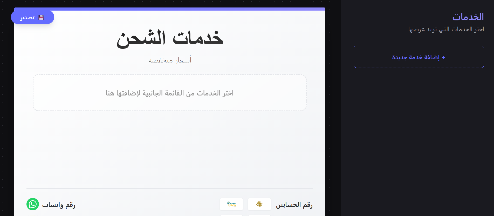
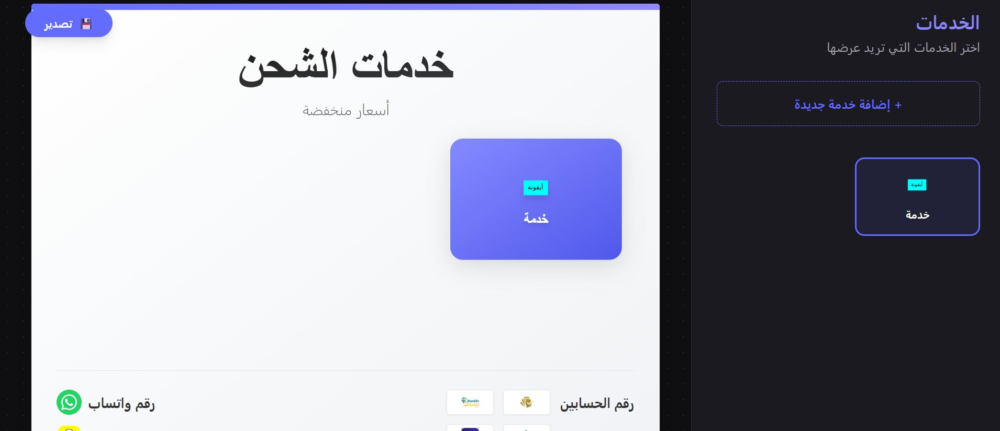

# Advertisement Manager

[العربية](README.md) | [Français](README_fr.md)

A cross-platform desktop application built with **Tauri**, **React**, and **Tailwind CSS**. 
This software allows you to easily create professional advertising posters.

## 🚀 Key Features

- **Custom Service Creation**: Add services with custom titles, colors, and icons (local images).
- **Real-time Preview**: Instantly visualize the rendering of the advertising poster.
- **Adaptive Layout**: The grid layout automatically adapts according to the number of services (3, 4, or 5 columns) for an aesthetic rendering.
- **Localized Footer**: Automatic integration of payment logos (Bankily, Sedad, Click, BCIpay) and contacts (Whatsapp, Snapchat).
- **Export**: Export your creation in one click in high-resolution **PNG** format.
- **Modern Interface**: Polished UI with 3D effects, gradients, and smooth animations.

## 🛠️ Technologies Used

- **Frontend**: React, Vite
- **Styling**: Tailwind CSS
- **Backend / Core**: Tauri (Rust)
- **Utilities**: `html-to-image` (export), `react-hot-toast` (notifications)

## 📋 Prerequisites

Before you begin, make sure you have installed:

1.  **Node.js** (version 18 or higher)
2.  **Rust** (via `rustup`)
3.  **C++ Build Tools** (for Windows: Visual Studio Build Tools with "Desktop development with C++")

## 🔧 Installation

Clone the project and install dependencies:

```bash
# Go to the project folder
cd advertisement_manager

# Install JavaScript dependencies
npm install
```

## ▶️ Running (Development)

To launch the application in development mode:

```bash
npm run tauri dev
```

## 📦 Build (Production)

To create the final optimized executable (`.exe` file):

```bash
npm run tauri build
```



